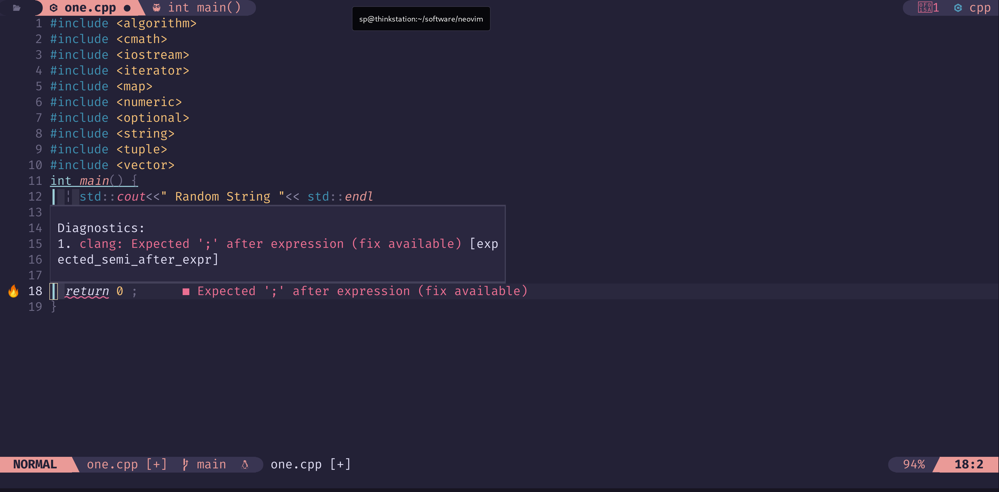

  


# Setting Up Neovim for Python/C/C++ Development
Neovim is a powerful, modernized fork of Vim that is designed for developers who want a lightweight, yet extensible text editor. Its speed, versatility, and rich plugin ecosystem make it an excellent choice for Python development. In this blog post, we'll walk through the steps to set up Neovim for a seamless Python development experience.


 


### Getting Started

First we need to get the latest stable version of Neovim ( currently 0.10.0 ). We can 
also install using the system package manager `(apt/yum/zypper) install neovim` or
we can get it from github.

```bash
mkdir ~/.local/bin/
cd ~/local/bin
wget https://github.com/neovim/neovim/releases/download/v0.10.2/nvim.appimage
mv nvim.appimage nvim
chmod +x nvim
export PATH=$PATH:~/.local/bin #  add ~/.local/bin to your PATH . Add this line to your ~/.bashrc 
```

### Dependencies : 

To add support for many of the Language Server Protocol (LSP)

features i.e., Formatting, Code action, goto documentation we need 

few packages which add this functionality. Programming Languages 

that I use.

| Language  | Package | How to Install |
| ---------- | ------- | --------------- |
| c/c++  	|	clangd| (apt/yum/dnf/zypper) install clangd| 
| Lua    	|	lua_ls|https://luals.github.io/#neovim-install | 
| Bash   	|	bashls|https://github.com/bash-lsp/bash-language-server | 
| Vim Script|  vimls|https://github.com/iamcco/vim-language-server |
| Python	|	pylsp |`pip install python-lsp-server[all]`|
| CMake     | 	cmake| `pip install cmake-language-server` |
| Latex | 	    texlab|https://github.com/latex-lsp/texlab| 
| Text  |	    textls|https://github.com/hangyav/textLSP| 

#### Debian / Ubuntu 
    
    ``` bash 
        apt install clangd vim git cmake python3-venv luarocks tree-sitter-dev  fd-find ripgrep gdb ninja-build
    ```


###  List of Neovim Plugins

There are thousands of Neovim Plugins available  in github. Only use 
the one that you need. Here are the plugins that I use. 

     lazy.nvim                              # Plugin Manager


     • Comment.nvim                         # shortcuts to comment a section of code
     • alpha-nvim                           # Startup screen
     • coq_nvim                             # Autocomplete suggestions
     • indent-blankline.nvim                # Shows nice indentation levels of code 
     • lualine.nvim                         # Status line
     • nvim-autopairs                       # Automatically insert (){}[] 
     • nvim-lspconfig                       # This configures LSP
     • nvim-treesitter                      # Faster/Modern Syntax highlight
     • nvim-web-devicons                    # Provides icons 
     • plenary.nvim                         # Lua functionality
     • rose-pine                            # Theme That I use
     • telescope.nvim                       # Fuzzy finder for files or LSP objects

## Install this config

 1. clone the repo
    ```bash
    cd ~/.config/
    git clone https://github.com/srbhp/nvim.git
    ```
 
 2. Install Plugins

    Launch Neovim and run the following command to install the plugins:
    ```vim
    :Lazy
    ```
3. Install `coq_nvim` dependencies:
   This need `python3-venv` package to be installed. 
   ```vim
    :COQdeps
   ```
4. Check Neovim Health.
   
   ```vim
   :checkhealth
   ```
   This will give you current status of the Neovim and report
   if there is any missing depndencies. 
